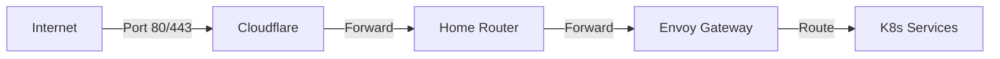
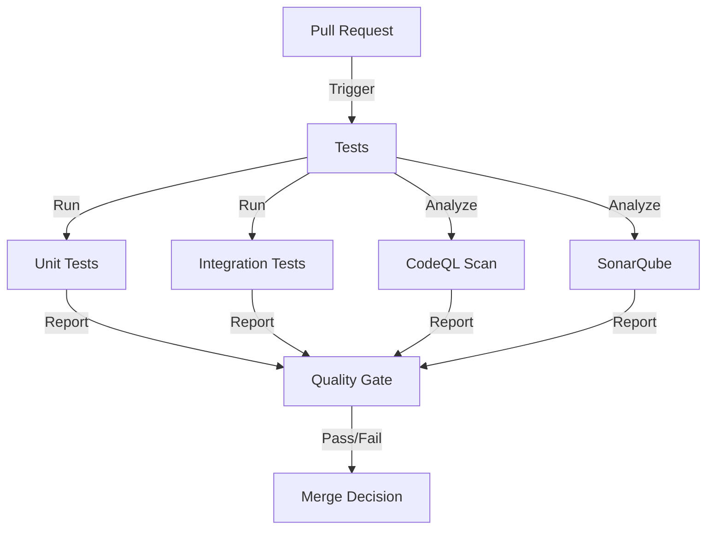
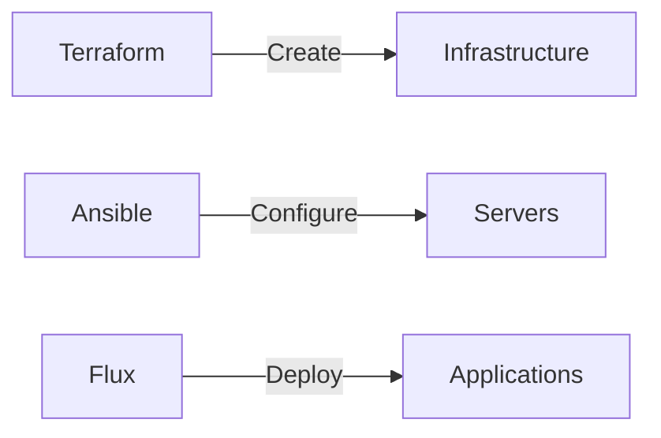
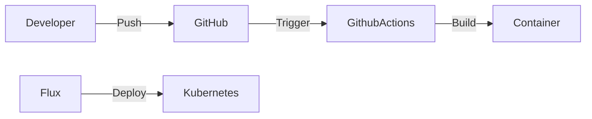

# Modern Cloud-Native Infrastructure Architecture

## Overview

This document outlines a modern, cloud-native infrastructure architecture focusing on GitOps principles, service mesh capabilities, and comprehensive observability. The architecture is designed for high availability, scalability, and security.

## Core Components

### 1. Infrastructure Provisioning (IaC)

#### Terraform (`/terraform`)
- Cloud resource provisioning
- Network configuration
- Storage management
- State managed in remote backend
```hcl
terraform/
├── environments/
│   ├── dev/
│   ├── staging/
│   └── prod/
├── modules/
│   ├── kubernetes/
│   ├── networking/
│   └── storage/
└── shared/
```

#### Ansible (`/ansible`)
- Server configuration
- Security hardening
- Base software installation
```yaml
ansible/
├── inventory/
├── playbooks/
└── roles/
    ├── common/
    ├── kubernetes/
    └── security/
```

### 2. GitOps Pipeline

#### Source Control
- GitHub repository structure:
```
repository/
├── apps/
│   └── [application-name]/
│       ├── base/
│       └── overlays/
├── infrastructure/
│   ├── monitoring/
│   ├── security/
│   └── networking/
└── clusters/
    ├── dev/
    ├── staging/
    └── prod/
```

#### Continuous Integration (GitHub Actions)
```yaml
.github/workflows/
├── build.yaml        # Build and test
├── security-scan.yaml # Security scanning
└── release.yaml      # Release workflow
```

#### Continuous Deployment (Flux)
- Pull-based GitOps model
- Automatic drift detection
- Image update automation
```yaml
flux-system/
├── gotk-components.yaml
├── gotk-sync.yaml
└── kustomization.yaml
```

### 3. Service Mesh & Traffic Management

#### Istio
- Service-to-service communication
- Traffic management
- Security policies
- Telemetry collection

#### Envoy Gateway
- Ingress traffic management
- Load balancing
- TLS termination
- Rate limiting

### 4. Observability Stack

#### Metrics
- **Prometheus**
  - Metrics collection
  - Long-term storage
  - Alert rules

#### Logging
- **Loki**
  - Log aggregation
  - Log querying
  - Label-based logging

#### Tracing
- **Jaeger**
  - Distributed tracing
  - Performance monitoring
  - Root cause analysis

#### Visualization
- **Grafana**
  - Unified dashboards
  - Alert management
  - Data source integration

### 5. Security

#### Access Control
- RBAC for Kubernetes
- Service-to-service mTLS
- Network policies

#### Secrets Management
- HashiCorp Vault
- Sealed Secrets
- External Secrets Operator

## Home Server Configuration

### Public Access Setup
- Domain: dev.naratecho.com
- DNS Configuration:
  - Dynamic DNS updates
  - Cloudflare for DNS management and DDoS protection
- Port Forwarding:
  - 80/443 for HTTP/HTTPS
  - Custom ports for specific services

### Network Architecture


### Security Considerations
- Cloudflare as security layer
- Rate limiting at Envoy level
- Network segmentation
- Regular security audits
- Fail2ban for intrusion prevention

## Quality Assurance Pipeline

### Code Quality
- **SonarQube**:
  - Hosted in quality-assurance namespace
  - Separate workflow for each app
  - Custom quality gates per project

- **CodeQL**:
  - Security scanning
  - Dependency checks
  - Automated PR reviews

### Testing Strategy


### App-Specific Workflows
```yaml
# Example app-specific GitHub Action
name: App1 Pipeline
on:
  pull_request:
    paths:
      - 'apps/app1/**'
jobs:
  test:
    runs-on: ubuntu-latest
    steps:
      - unit-tests
      - integration-tests
      - sonarqube-scan
      - codeql-analyze
  deploy:
    needs: test
    if: github.ref == 'refs/heads/main'
    steps:
      - build-container
      - push-to-registry
```

## Microservices Management

### Service Organization
- Each microservice in separate namespace
- Individual scaling policies
- Service-specific monitoring

### Resource Management
```yaml
# Example resource quotas per namespace
apiVersion: v1
kind: ResourceQuota
metadata:
  name: app1-quota
  namespace: app1
spec:
  hard:
    requests.cpu: "4"
    requests.memory: 8Gi
    limits.cpu: "8"
    limits.memory: 16Gi
```

## Directory Structure

```
/infra_prov/
├── terraform/           # Infrastructure as Code
├── ansible/            # Configuration management
├── kubernetes/         # Kubernetes manifests
│   ├── apps/          # Application deployments
│   ├── infrastructure/ # Infrastructure components
│   └── security/      # Security policies
├── monitoring/        # Observability configurations
│   ├── prometheus/
│   ├── grafana/
│   └── jaeger/
└── docs/             # Documentation
```

## Deployment Flow

1. **Infrastructure Provisioning**


2. **Application Deployment**


3. **Traffic Flow**


## Implementation Phases

### Phase 1: Foundation
1. Infrastructure setup with Terraform
2. Base configuration with Ansible
3. Kubernetes cluster deployment

### Phase 2: Core Services
1. Flux installation and configuration
2. Envoy Gateway deployment
3. Istio service mesh setup

### Phase 3: Observability
1. Prometheus & Grafana deployment
2. Loki setup for logging
3. Jaeger implementation for tracing

### Phase 4: Security
1. RBAC configuration
2. Network policies implementation
3. Secrets management setup

## Maintenance and Operations

### Backup Strategy
- Velero for Kubernetes backup
- Infrastructure state backup
- Application data backup

### Disaster Recovery
- Multi-region setup
- Automated failover
- Regular DR testing

### Monitoring and Alerting
- Critical metrics monitoring
- Alert routing and escalation
- Performance tracking

## Security Considerations

### Network Security
- Network segmentation
- Firewall rules
- Ingress/Egress controls

### Application Security
- Container scanning
- Dependency scanning
- Runtime security

### Compliance
- Audit logging
- Policy enforcement
- Compliance reporting

## Best Practices

### GitOps
- Git as single source of truth
- Declarative configurations
- Automated reconciliation

### Infrastructure
- Immutable infrastructure
- Infrastructure as Code
- Configuration as Code

### Security
- Zero trust architecture
- Least privilege access
- Regular security audits

## Future Enhancements

### Short Term
- Implement auto-scaling
- Enhanced monitoring
- Security hardening

### Long Term
- Multi-cluster federation
- Advanced automation
- AI/ML operations

## Support and Maintenance

### Documentation
- Architecture updates
- Operational procedures
- Troubleshooting guides

### Monitoring
- Performance metrics
- Resource utilization
- Cost optimization

### Updates
- Regular patching
- Version upgrades
- Security updates
